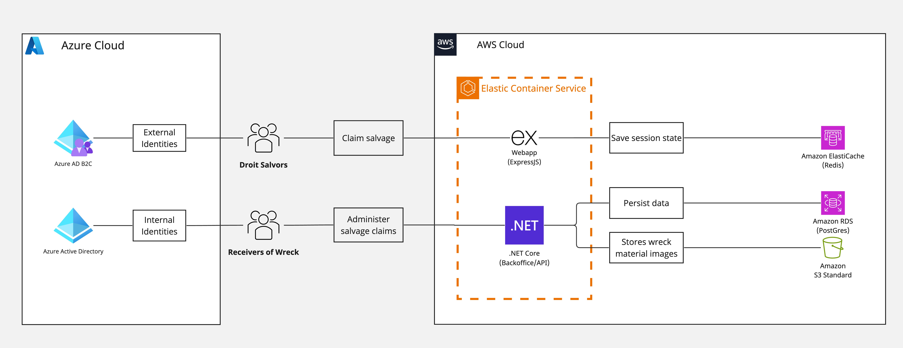

# Droits reporting service

The Droits reporting service enables:

- Salvage owners to report their findings with the Maritime & CoastGuard Agency
- Recievers of Wreck to manage these reports 

It comprises two applications

1. A public facing frontend etc in the `webapp/` directory
2. The backoffice API which handles the incoming registrations and is an admin application to handle the reports

## Architecture

Infrastructure-as-code remains the single source-of-truth for Droits infrastructure! Always check `terraform/` if
unsure.

## Local development

| **dependency**                                                    | **version** |
|-------------------------------------------------------------------|-------------|
| [dotnet](https://learn.microsoft.com/en-us/dotnet/)               | 8.x         |
| [nvm](https://github.com/nvm-sh/nvm)                              | 0.39.5      |
| [terraform](https://www.terraform.io/)                            | 1.4.6       |
| [Docker desktop](https://www.docker.com/products/docker-desktop/) | Latest      |

## Infrastructure-as-code

The [Terraform](./terraform) directory contains the Terraform code for managing the infrastructure for the Droits 
reporting service.

## Deployment

Automated testing, building and deployment is performed using GitHub Actions with configuration held in
`.github/workflows`.

### Development environment

A build and deployment to the development environment is triggered on each push to `main`. Docker images are tagged
with the hash of the triggering commit and published to AWS Elastic Container Registry. Images built and deployed to
for the development environment are ephemeral and not used anywhere else.

### Staging environment

A build and deployment to the staging environment is triggered on a manual release set to "pre-release". Docker images are tagged
with the hash of the triggering commit and published to AWS Elastic Container Registry. Images built and deployed to
for the staging environment are ephemeral and not used anywhere else.

### Production environment

A build and deployment to the production environment is triggered on a manual release set to "release". Docker images are tagged
with the hash of the triggering commit and published to AWS Elastic Container Registry. Images built and deployed to
for the production environment are ephemeral and not used anywhere else.

## Secrets

Secrets are set in the Repository and injected during deployment.

## License

Unless stated otherwise, the codebase is released under [the MIT License][mit]. This covers both the codebase and any
sample code in the documentation.

The documentation is [&copy; Crown copyright][copyright] and available under the terms of the [Open Government 3.0][ogl]
licence.

[mit]: LICENCE
[copyright]: http://www.nationalarchives.gov.uk/information-management/re-using-public-sector-information/uk-government-licensing-framework/crown-copyright/
[ogl]: http://www.nationalarchives.gov.uk/doc/open-government-licence/version/3/
